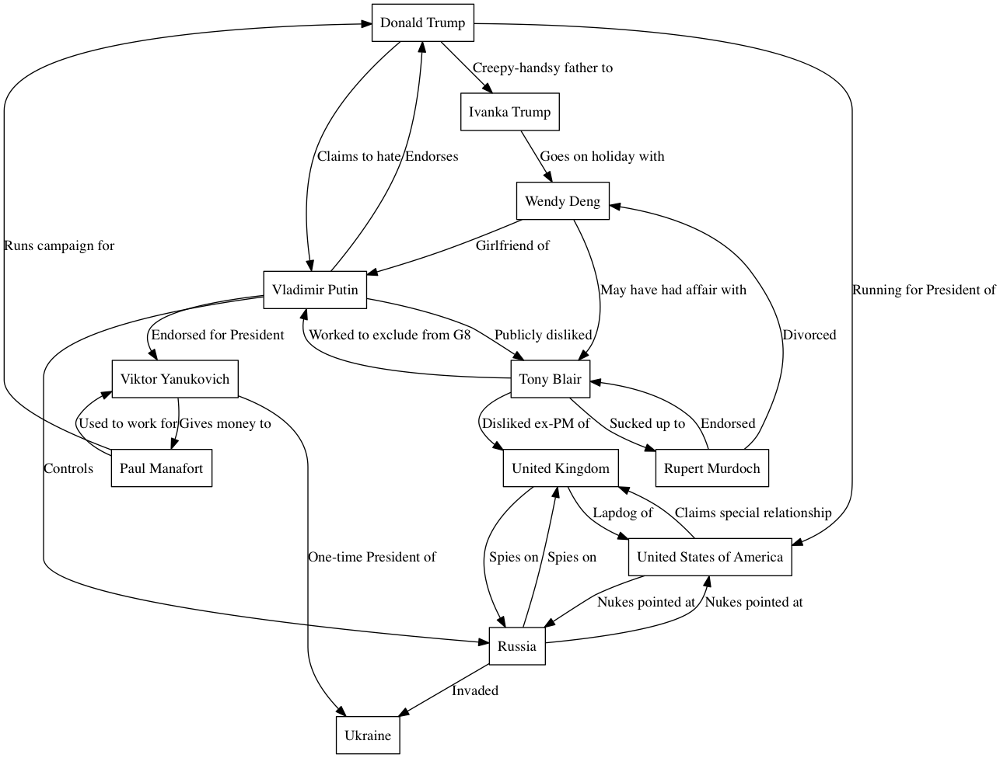

This is a repo for holding a graphviz .dot file that demonstrates odd relationships.

It produces this graphic:

You may edit the dot file and then produce a new image with `dot conspiracy.dot -O -Tpng`

Please note: I do not believe there is a conspiracy, but when people talk about these conspiracies, it's worth taking into account relationships like this.

Pull requests welcome. Released under the Anarchist License:

You are free to do whatever you want with the contents of this repository. In particular, it is hereby granted the permission to use, copy, study, modify, and/or distribute this software and its source, for any purpose and by any means, without any conditions whatsoever.

But what you do with it is your own responsibility. The software is provided as is, with no warranty or liability of any kind.

The authors kindly ask, in a non legally-binding way, that you respect and preserve the spirit of openness, sharing, learning and collaboration, with which their work was freely given.
